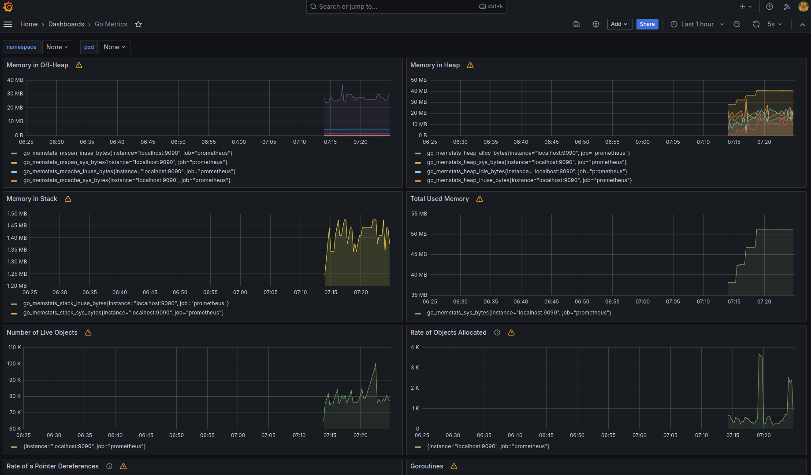

# MeetSpace Backend

## Screenshots

Here is an example screenshot of the app:

#### Monitor

# Tech Stack

This project utilizes the following technologies:

- **System Design**

  - Load Balancing - Nginx load balancer to distribute traffic
  - Redis Caching - Frequently accessed data is cached in Redis to optimize performance
  - Relational Database - PostgreSQL is used as the persistent data store
  - Containerization - Docker containers used for easy deployment and scaling
  - Continuous Integration - GitHub actions workflow automates testing and deployment

- **Backend**
  - Golang/Gin - Server framework
  - Redis - caching
  - PostgreSQL - SQL database
  - GORM - SQL object mapping/modeling
  - JSON Web Tokens - For authentication
  - Logging - logging using logrus

**Infrastructure**

- Docker - Containerization
- Docker-Compose - For managing multiple container services
- Nginx - Web server
- Github Actions - Continuous integration & deployment

## Features

- **Authentication and authorization**

  - Login with email / password credentials
  - JWT token generation
  - Restrict access to certain routes based on login state and permissions

- **User management**

  - New user signup
  - Email verification process
  - Profile updates
  - Password reset workflow

- **Real-time communication**

  - Chat messaging using websockets
  - Live notifications on events

- **Modular Design:**

  - Code is structured logically for maintainability.

- **Gin Web Framework:**

  - Built with the fast, light, and productive Gin framework.

- **WebSoket APIs:**
- Websocket APIs integration.
- **RESTful APIs:**
- Clean and well-documented REST APIs.
- **Database Integrations:**
  - Integrates with PostgreSQL.
- **Validation:**
  - Request validation middleware for security.
- **Caching:**
  - Redis cache support for improving performance.
- **Logging:**
  - Configurable logging using Logrus.
- **Swagger Docs:**
  - Auto-generated Swagger docs for API testing.
- **Unit Testing:**
  - Tests written using Go's standard library.
- **Docker Support:**
  - Dockerfile and docker-compose files included.
- **CORS Support:**
  - Cross-Origin Resource Sharing enabled.
- **Pagination Support:**
  - Pagination middleware for handling large datasets.
- **Rate Limiting:**
  - Throttles requests to protect against attacks.
- **Structured Error Handling:**
  - Common error struct with fields for error metadata.
- **CI/CD Pipelines:**
  - Industry standard GitHub workflows for Continuous Delivery.

## Changelog

For a detailed list of changes made to this project, please refer to the [Changelog](CHANGELOG.md).
