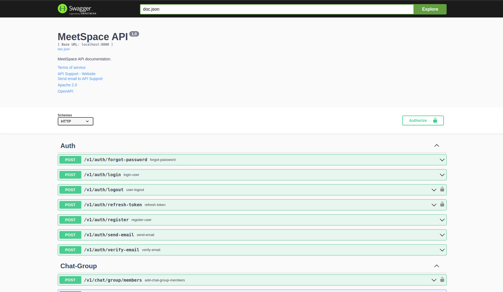

# MeetSpace Backend

## Screenshots

Here is an example screenshot of the app:

# Tech Stack

This project utilizes the following technologies:

- **System Design**

  - Load Balancing - Nginx load balancer to distribute traffic
  - Redis Caching - Frequently accessed data is cached in Redis to optimize performance
  - Relational Database - PostgreSQL is used as the persistent data store
  - Containerization - Docker containers used for easy deployment and scaling
  - Continuous Integration - GitHub actions workflow automates testing and deployment

- **Backend**
  - Golang/Gin - Server framework
  - Redis - caching
  - PostgreSQL - SQL database
  - GORM - SQL object mapping/modeling
  - JSON Web Tokens - For authentication
  - Logging - logging using logrus

**Infrastructure**

- Docker - Containerization
- Docker-Compose - For managing multiple container services
- Nginx - Web server
- Github Actions - Continuous integration & deployment

## Features

- Authentication and authorization

  - Login with email / password credentials
  - JWT token generation
  - Restrict access to certain routes based on login state and permissions

- User management
  - New user signup
  - Email verification process
  - Profile updates
  - Password reset workflow
- Resource management

  - CRUD (Create / Read / Update / Delete) API for resources
  - Pagination and filtering when retrieving resources
  - Image upload and storage

- Real-time communication

  - Chat messaging using websockets
  - Live notifications on events
  - Comment streams / feed for user content

## Changelog

For a detailed list of changes made to this project, please refer to the [Changelog](CHANGELOG.md).
